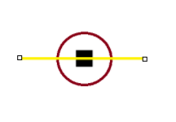

O sistema de angulação no Kaplay funciona de uma forma um pouco diferente. O círculo de angulação funciona da seguinte forma:

Considere o quadrado preto um objeto qualquer, o Círculo vermelho e a linha amarela como uma referência.

A parte do círculo acima da linha representa um intervalo (a partir da esquerda) de 0 a 180 graus, enquanto a parte abaixo representa um intervalo de -0 a -180 graus, também a partir da esquerda.

Portanto, não deve-se seguir o padrão de 0 a 360 graus.